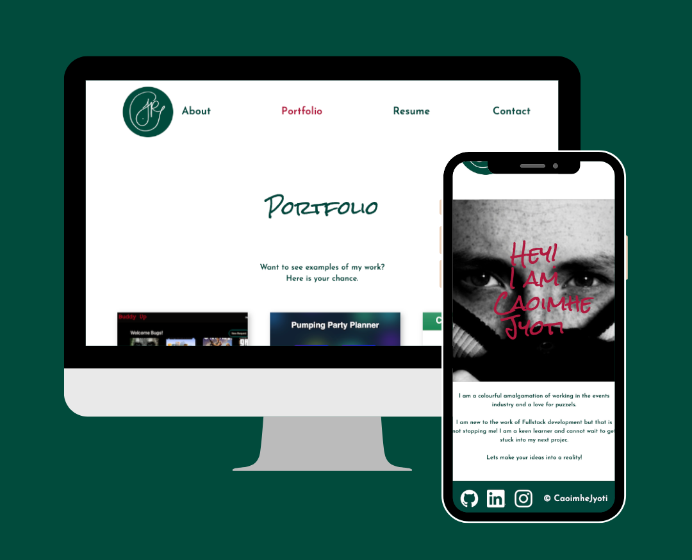

# CaoimheJyoti

---

Personal portfolio website created using React.

            

---

[About](#about) ✦ [Deployment](#deployment) ✦ [Features](#features) ✦ [License](#license) ✦ [Contact](#contact)

---

## About

This is my personal portfolio. It features examples of my work, a downloadable resume and a contact form.

Please note the contact form is in development. Updates coming. If you wish to get in touch - please use the links at the end of this README.

## Deployment

[CaoimheJyoti](https://caoimhejyoti.github.io/caoimhejyoti-react/)

## Features

My profile has been styled with the MUI components library and React-Bootstrap to ensure the multi-page layout has the best UX and UI.

This portfolio is fully responsive.

## License

This project is using the following license:

**MIT**

For further information regarding the license, please follow the link below:
https://opensource.org/licenses/MIT

---

## Contact

If you have any further questions, please contact via email or github.

 
